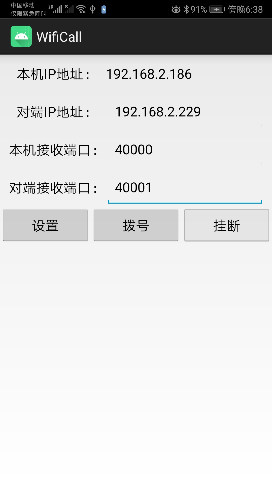

# WiFiCall
实现同一局域网设备之间语音通话功能

## 使用方法
1.两台设备都安装此应用，按照提示给对应的权限
2.两台设备连接同一个WiFi，或者其中一台设备开启热点，另外一台设备连接这个热点
3.当两台设备在同一个局域网之后。在手机的WLAN设置中查询自己手机当前的IP地址，然后在应用中设置。

##使用演示
1.配置界面：

2.ip地址和端口示例:
手机1的ip地址：192.168.2.229， 手机2的ip地址：192.168.2.186
手机1的配置信息填写：
192.168.2.186
40001
40000

手机2的配置信息填写：
192.168.2.229
40000
40001

3.点击设置，完成设置之后，点拨号就可以实现语音通话了